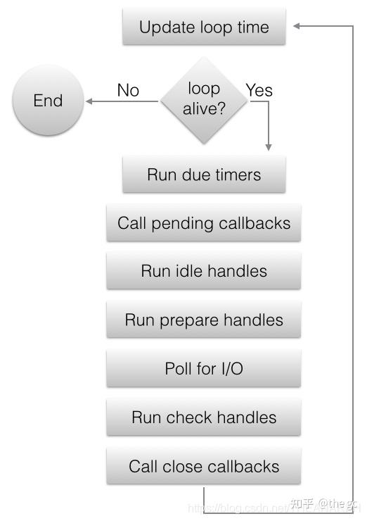

**Nodejs 是一个开源和跨平台的 js 运行时环境！！！**

js 代码<-->V8 引擎<-->Nodejs Bindings(node api)<---->Libuv

nodejs 启动--> 注册 C++模块 ---> 初始化模块加载器 ---> 初始化 V8 ---> 初始化 libuv ---> 初始化 libuv 事件循环 ---> 启动事件循环 ---> 启动 V8 ---> 启动 libuv ---> 启动 libuv 事件循环 ---> 启动事件循环 ---> 启动 V8 ---> 启动 libuv ---> 启动 libuv 事件循环 --->启动事件循环 ---> 启动 V8 ---> 启动 libuv ---> 启动 libuv 事件循环 --->

# NOdejs 启动过程

## 注册 C++模块

首先 Node.js 会调用 registerBuiltinModules 函数注册 C++模块，这个函数会调用一系列 registerxxx 的函数
Node.js-->-->registerModule

## 创建 Environment 对象，并绑定到 Context

注册完 C++模块后就开始创建 Environment 对象，Environment 是 Node.js 执行时的环境对象，类似一个全局变量的作用，他记录了 Node.js 在运行时的一些公共数据。创建完 Environment 后，Node.js 会把该对象绑定到 V8 的 Context 中，为什么要这样做呢？主要是为了在 V8 的执行上下文里拿到 env 对象，因为 V8 中只有 Isolate、Context 这些对象。如果我们想在 V8 的执行环境中获取 Environment 对象的内容，就可以通过 Context 获取 Environment 对象。
Node.js-->-->registerModule-->-->createEnvironment-->-->createContext

## 初始化模块加载器

1. Node.js 首先传入 c++模块加载器，执行 loader.js，loader.js 主要是封装了 c++模块加载器和原生 js 模块加载器。并保存到 env 对象中。
2. 接着传入 c++和原生 js 模块加载器，执行 run_main_module.js。
3. 在 run_main_module.js 中传入 js 和原生 js 模块加载器，执行用户的 js。
   假设用户 js 如下

```js
require("net")
require("./myModule")
```

分别加载了一个用户模块和原生 js 模块，我们看看加载过程，执行 require 的时候。

1. Node.js 首先会判断是否是原生 js 模块，如果不是则直接加载用户模块，否则，会使用原生模块加载器加载原生 js 模块。
2. 加载原生 js 模块的时候，如果用到了 c++模块，则使用 internalBinding 去加载。

## 执行用户 JS 代码，然后进入 Libuv 事件循环

接着 Node.js 就会执行用户的 js，通常用户的 js 会给事件循环生产任务，然后就进入了事件循环系统，比如我们 listen 一个服务器的时候，就会在事件循环中新建一个 tcp handle。Node.js 就会在这个事件循环中一直运行。
事件循环主要分为 7 个阶段。timer 阶段主要是处理定时器相关的任务，pending 阶段主要是处理 poll io 阶段回调里产生的回调。check、prepare、idle 阶段是自定义的阶段，这三个阶段的任务每次事件序循环都会被执行。Poll io 阶段主要是处理网络 IO、信号、线程池等等任务。closing 阶段主要是处理关闭的 handle，比如停止关闭服务器。

1 timer 阶段: 用二叉堆实现，最快过期的在根节点。 2 pending 阶段：处理 poll io 阶段回调里产生的回调 3 check、prepare、idle 阶段：每次事件循环都会被执行。 4 poll io 阶段：处理文件描述符相关事件。 5 closing 阶段：执行调用 uv_close 函数时传入的回调。
