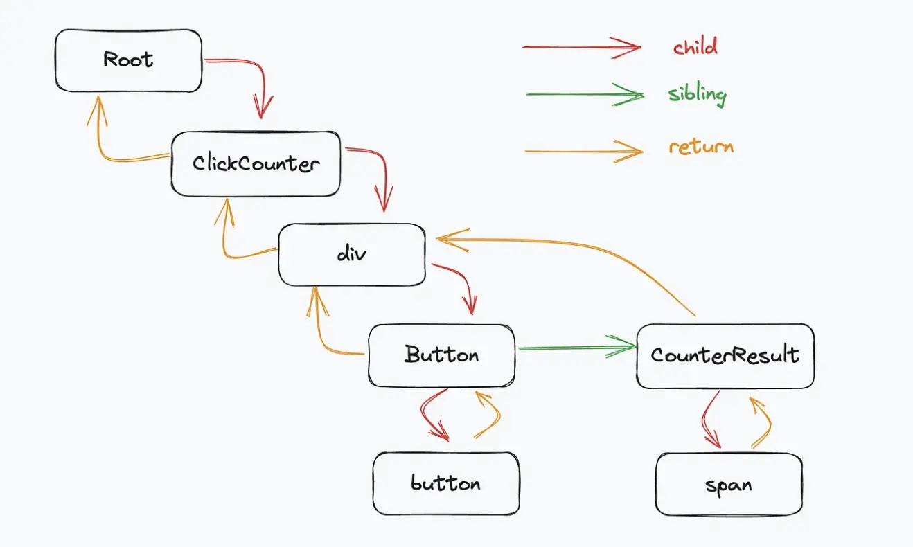

# What's Fiber？

React 的基本组成：当我们写 React 组件并使用 JSX 时，React 在底层会将 JSX 转换为元素的对象结构。例如：

```js
const element = <div>Hello, world!</div>
```

React 会将其转换为以下对象结构：

```js
const element = React.createElement("h1", null, "Hello, world")
```

为了将这个元素渲染到 DOM 上，React 需要创建一种内部实例，用来追踪该组件的所有信息和状态。在早期版本的 React 中，我们称之为“实例”或“虚拟 DOM 对象”。但在 Fiber 架构中，这个新的工作单元就叫做 Fiber。
所以，在本质上，Fiber 是一个 JavaScript 对象，代表 React 的一个工作单元，它包含了与组件相关的信息。一个简化的 Fiber 对象长这样：

```js
const fiber = {
  type: "div",
  props: {
    children: "Hello, world",
  },
  child: null,
  sibling: null,
  return: null,
  stateNode: null,
  alternate: null,
  pendingProps: null,
  memoizedProps: null,
  memoizedState: null,
  dependencies: null,
}
```

当 React 开始工作时，它会沿着 Fiber 树形结构进行，试图完成每个 Fiber 的工作（例如，比较新旧 props，确定是否需要更新组件等）。如果主线程有更重要的工作（例如，响应用户输入），则 React 可以中断当前工作并返回执行主线程上的任务。

因此，Fiber 不仅仅是代表组件的一个内部对象，它还是 React 的调度和更新机制的核心组成部分。

# Why do we need Fiber？

在 React 16 之前的版本中，是使用递归的方式处理组件树更新，称为堆栈调和（Stack Reconciliation），这种方法一旦开始就不能中断，直到整个组件树都被遍历完。这种机制在处理大量数据或复杂视图时可能导致主线程被阻塞，从而使应用无法及时响应用户的输入或其他高优先级任务。

Fiber 的引入改变了这一情况。Fiber 可以理解为是 React 自定义的一个带有链接关系的 DOM 树，每个 Fiber 都代表了一个工作单元，React 可以在处理任何 Fiber 之前判断是否有足够的时间完成该工作，并在必要时中断和恢复工作。

# Fiber structure

源码里 FiberNode 的结构：

```js
function FiberNode(
  this: $FlowFixMe,
  tag: WorkTag,
  pendingProps: mixed,
  key: null | string,
  mode: TypeOfMode
) {
  // 基本属性
  this.tag = tag // 描述此Fiber的启动模式的值（LegacyRoot = 0; ConcurrentRoot = 1）
  this.key = key // React key
  this.elementType = null // 描述React元素的类型。例如，对于JSX<App />，elementType是App
  this.type = null // 组件类型
  this.stateNode = null // 对于类组件，这是类的实例；对于DOM元素，它是对应的DOM节点。

  // Fiber链接
  this.return = null // 指向父Fiber
  this.child = null // 指向第一个子Fiber
  this.sibling = null // 指向其兄弟Fiber
  this.index = 0 // 子Fiber中的索引位置

  this.ref = null // 如果组件上有ref属性，则该属性指向它
  this.refCleanup = null // 如果组件上的ref属性在更新中被删除或更改，此字段会用于追踪需要清理的旧ref

  // Props & State
  this.pendingProps = pendingProps // 正在等待处理的新props
  this.memoizedProps = null // 上一次渲染时的props
  this.updateQueue = null // 一个队列，包含了该Fiber上的状态更新和副作用
  this.memoizedState = null // 上一次渲染时的state
  this.dependencies = null // 该Fiber订阅的上下文或其他资源的描述

  // 工作模式
  this.mode = mode // 描述Fiber工作模式的标志（例如Concurrent模式、Blocking模式等）。

  // Effects
  this.flags = NoFlags // 描述该Fiber发生的副作用的标志（十六进制的标识）
  this.subtreeFlags = NoFlags // 描述该Fiber子树中发生的副作用的标志（十六进制的标识）
  this.deletions = null // 在commit阶段要删除的子Fiber数组

  this.lanes = NoLanes // 与React的并发模式有关的调度概念。
  this.childLanes = NoLanes // 与React的并发模式有关的调度概念。

  this.alternate = null // Current Tree和Work-in-progress (WIP) Tree的互相指向对方tree里的对应单元

  // 如果启用了性能分析
  if (enableProfilerTimer) {
    // ……
  }

  // 开发模式中
  if (__DEV__) {
    // ……
  }
}
```

其实可以理解为是一个更强大的虚拟 DOM。

# Fiber 工作原理

Fiber 工作原理中最核心的点就是：可以中断和恢复，这个特性增强了 React 的并发性和响应性。

实现可中断和恢复的原因就在于：Fiber 的数据结构里提供的信息让 React 可以追踪工作进度、管理调度和同步更新到 DOM

Fiber 工作原理中的几个关键点：

- 单元工作：每个 Fiber 节点代表一个单元，所有 Fiber 节点共同组成一个 Fiber 链表树（有链接属性，同时又有树的结构），这种结构让 React 可以细粒度控制节点的行为。

- 链接属性：child、sibling 和 return 字段构成了 Fiber 之间的链接关系，使 React 能够遍历组件树并知道从哪里开始、继续或停止工作。
  

- 双缓冲技术: React 在更新时，会根据现有的 Fiber 树（Current Tree）创建一个新的临时树（Work-in-progress (WIP) Tree），WIP-Tree 包含了当前更新受影响的最高节点直至其所有子孙节点。Current Tree 是当前显示在页面上的视图，WIP-Tree 则是在后台进行更新，WIP-Tree 更新完成后会复制其它节点，并最终替换掉 Current Tree，成为新的 Current Tree。因为 React 在更新时总是维护了两个 Fiber 树，所以可以随时进行比较、中断或恢复等操作，而且这种机制让 React 能够同时具备拥有优秀的渲染性能和 UI 的稳定性。

- State 和 Props：memoizedProps、pendingProps 和 memoizedState 字段让 React 知道组件的上一个状态和即将应用的状态。通过比较这些值，React 可以决定组件是否需要更新，从而避免不必要的渲染，提高性能。

- 副作用的追踪：flags 和 subtreeFlags 字段标识 Fiber 及其子树中需要执行的副作用，例如 DOM 更新、生命周期方法调用等。React 会积累这些副作用，然后在 Commit 阶段一次性执行，从而提高效率。

# Fiber 工作流程

1. 初始化：React 会创建一个 Fiber 树，其中包含了所有的组件节点。
2. 构建：React 会遍历 Fiber 树，根据组件的生命周期方法和 props 等信息，构建出对应的 Fiber 节点。
3. 调度：React 会根据优先级和时间等因素，将 Fiber 节点分配给不同的工作线程。
4. 执行：工作线程会从 Fiber 树中取出需要执行的 Fiber 节点，并执行其对应的生命周期方法和 props 等信息。
5. 渲染：工作线程会将执行结果渲染到 DOM 上。
6. 提交：React 会将 DOM 上的变化提交到浏览器中，触发浏览器的重新渲染。
7. 循环：React 会重复上述步骤，直到整个 Fiber 树都被遍历完。

## 第一阶段：Reconciliation（调和）

- 目标: 确定哪些部分的 UI 需要更新。
- 原理: 这是 React 构建工作进度树的阶段，会比较新的 props 和旧的 Fiber 树来确定哪些部分需要更新。
  1、遍历 Fiber 树：BeforeMutation
  2、构建更新队列：UpdateQueue
  3、构建副作用列表：CommitMutation
  4、处理 layout effects：commitLayout
  5、构建新的 Fiber 树：CommitLayout
  6、构建新的 Fiber 树：CommitRoot
  7、构建新的 Fiber 树：CommitWork
  调和阶段又分为三个小阶段：
  - 创建与标记更新节点：beginWork
    - 判断 Fiber 节点是否要更新
    - 判断 Fiber 子节点是更新还是复用
    - mountChildFibers 和 reconcileChildFibers 最终会进入同一个方法 createChildReconciler，执行 Fiber 节点的调和（处理诸如新的 Fiber 创建、旧 Fiber 删除或现有 Fiber 更新等操作）。而整个 beginWork 完成后，就会进入 completeWork 流程。
  - 收集副作用列表：completeUnitOfWork 和 completeWork - completeUnitOfWork 负责遍历 Fiber 节点，同时记录了有副作用节点的关系。
    bubbleProperties 为 completeWork 完成了两个工作：

记录 Fiber 的副作用标志
为子 Fiber 创建链表
这两个工作都从下面这段代码中看出来：

```js
// packages/react-reconciler/src/ReactFiberCompleteWork.js
// 以下只是核心逻辑的代码，不是bubbleProperties的完整源码
function bubbleProperties(completedWork: Fiber) {
  const didBailout =
    completedWork.alternate !== null &&
    completedWork.alternate.child === completedWork.child // 当前的Fiber与其alternate（备用/上一次的Fiber）有相同的子节点，则跳过更新

  let newChildLanes = NoLanes // 合并后的子Fiber的lanes
  let subtreeFlags = NoFlags // 子树的flags。

  if (!didBailout) {
    // 没有bailout，需要冒泡子Fiber的属性到父Fiber
    let child = completedWork.child
    // 遍历子Fiber，并合并它们的lanes和flags
    while (child !== null) {
      newChildLanes = mergeLanes(
        newChildLanes,
        mergeLanes(child.lanes, child.childLanes)
      )

      subtreeFlags |= child.subtreeFlags
      subtreeFlags |= child.flags

      child.return = completedWork // Fiber的return指向父Fiber，确保整个Fiber树的一致性
      child = child.sibling
    }
    completedWork.subtreeFlags |= subtreeFlags // 合并所有flags（副作用）
  } else {
    // 有bailout，只冒泡那些具有“静态”生命周期的flags
    let child = completedWork.child
    while (child !== null) {
      newChildLanes = mergeLanes(
        newChildLanes,
        mergeLanes(child.lanes, child.childLanes)
      )

      subtreeFlags |= child.subtreeFlags & StaticMask // 不同
      subtreeFlags |= child.flags & StaticMask // 不同

      child.return = completedWork
      child = child.sibling
    }
    completedWork.subtreeFlags |= subtreeFlags
  }
  completedWork.childLanes = newChildLanes // 获取所有子Fiber的lanes。
  return didBailout
}
```

### 调和阶段知识拓展

1、为什么 Fiber 架构更快？
在上面这段代码里，我们还可以看出来为什么 Fiber 架构比以前的递归 DOM 计算要快：flags 或 subtreeFlags 是 16 进制的标识，在这里进行按位或(|)运算后，可以记录当前节点本身和子树的副作用类型，通过这个运算结果可以减少节点的遍历，从而提高性能。
2、调和过程可中断

前面我们提到，调和过程可以被中断，现在我们就看看源码里是怎么进行中断和恢复的。首先，我们要明确可中断的能力是 React 并发模式（Concurrent Mode）的核心，这种能力使得 React 可以优先处理高优先级的更新，而推迟低优先级的更新。

```js
// packages/react-reconciler/src/ReactFiberWorkLoop.js
// 以下只是核心逻辑的代码，不是renderRootConcurrent的完整源码
function renderRootConcurrent(root: FiberRoot, lanes: Lanes) {
  // 保存当前的执行上下文和 dispatcher
  const prevExecutionContext = executionContext
  executionContext |= RenderContext
  const prevDispatcher = pushDispatcher(root.containerInfo)
  const prevCacheDispatcher = pushCacheDispatcher()

  if (workInProgressRoot !== root || workInProgressRootRenderLanes !== lanes) {
    // 如果当前的工作进度树与传入的 root 或 lanes 不匹配，我们需要为新的渲染任务准备一个新的堆栈。
    // ……
  }

  // 持续的工作循环，除非中断发生，否则会一直尝试完成渲染工作
  outer: do {
    try {
      if (
        workInProgressSuspendedReason !== NotSuspended &&
        workInProgress !== null
      ) {
        // 如果当前的工作进度是由于某种原因而被挂起的，并且仍然有工作待处理，那么会处理它
        const unitOfWork = workInProgress
        const thrownValue = workInProgressThrownValue

        // 根据不同挂起原因，进行中断、恢复等计算
        resumeOrUnwind: switch (workInProgressSuspendedReason) {
          case SuspendedOnError: {
            // 如果工作因错误被挂起，那么工作会被中断，并从最后一个已知的稳定点继续
            // ……省略逻辑
            break
          }
          case SuspendedOnData: {
            // 工作因等待数据（通常是一个异步请求的结果）而被挂起，
            // ……省略逻辑
            break outer
          }
          case SuspendedOnInstance: {
            // 将挂起的原因更新为SuspendedOnInstanceAndReadyToContinue并中断工作循环，标记为稍后准备好继续执行
            workInProgressSuspendedReason =
              SuspendedOnInstanceAndReadyToContinue
            break outer
          }
          case SuspendedAndReadyToContinue: {
            // 表示之前的挂起工作现在已经准备好继续执行
            if (isThenableResolved(thenable)) {
              // 如果已解析，这意味着需要的数据现在已经可用
              workInProgressSuspendedReason = NotSuspended
              workInProgressThrownValue = null
              replaySuspendedUnitOfWork(unitOfWork) // 恢复执行被挂起的工作
            } else {
              workInProgressSuspendedReason = NotSuspended
              workInProgressThrownValue = null
              throwAndUnwindWorkLoop(unitOfWork, thrownValue) // 继续循环
            }
            break
          }
          case SuspendedOnInstanceAndReadyToContinue: {
            // ……省略部分逻辑
            const isReady = preloadInstance(type, props)
            if (isReady) {
              // 实例已经准备好
              workInProgressSuspendedReason = NotSuspended // 该fiber已完成，不需要再挂起
              workInProgressThrownValue = null
              const sibling = hostFiber.sibling
              if (sibling !== null) {
                workInProgress = sibling // 有兄弟节点，开始处理兄弟节点
              } else {
                // 没有兄弟节点，回到父节点
                const returnFiber = hostFiber.return
                if (returnFiber !== null) {
                  workInProgress = returnFiber
                  completeUnitOfWork(returnFiber) // 收集副作用，前面有详细介绍
                } else {
                  workInProgress = null
                }
              }
              break resumeOrUnwind
            }
          }
          // 还有其它case
        }
      }

      workLoopConcurrent() // 如果没有任何工作被挂起，那么就会继续处理工作循环。
      break
    } catch (thrownValue) {
      handleThrow(root, thrownValue)
    }
  } while (true)

  // 重置了之前保存的执行上下文和dispatcher，确保后续的代码不会受到这个函数的影响
  resetContextDependencies()
  popDispatcher(prevDispatcher)
  popCacheDispatcher(prevCacheDispatcher)
  executionContext = prevExecutionContext

  // 检查调和是否已完成
  if (workInProgress !== null) {
    // 未完成
    return RootInProgress // 返回一个状态值，表示还有未完成
  } else {
    // 已完成
    workInProgressRoot = null // 重置root
    workInProgressRootRenderLanes = NoLanes // 重置Lane
    finishQueueingConcurrentUpdates() // 处理队列中的并发更新
    return workInProgressRootExitStatus // 返回当前渲染root的最终退出状态
  }
}
```

## 第二阶段：Commit（提交）

- 目标: 更新 DOM 并执行任何副作用。
- 原理: 遍历在 Reconciliation 阶段创建的副作用列表进行更新。
  1、遍历副作用列表：BeforeMutation

  ```js
  // packages/react-reconciler/src/ReactFiberCommitWork.js
  // 以下只是核心逻辑的代码，不是commitBeforeMutationEffects的完整源码
  export function commitBeforeMutationEffects(
    root: FiberRoot,
    firstChild: Fiber
  ): boolean {
    nextEffect = firstChild // nextEffect是遍历此链表时的当前fiber
    commitBeforeMutationEffects_begin() // 遍历fiber，处理节点删除和确认节点在before mutation阶段是否有要处理的副作用

    const shouldFire = shouldFireAfterActiveInstanceBlur // 当一个焦点元素被删除或隐藏时，它会被设置为 true
    shouldFireAfterActiveInstanceBlur = false
    focusedInstanceHandle = null

    return shouldFire
  }
  ```

  2、正式提交：CommitMutation

  ```js
  // packages/react-reconciler/src/ReactFiberCommitWork.js
  // 以下只是核心逻辑的代码，不是commitMutationEffects的完整源码
  export function commitMutationEffects(
    root: FiberRoot,
    finishedWork: Fiber,
    committedLanes: Lanes
  ) {
    // lanes和root被设置为"in progress"状态，表示它们正在被处理
    inProgressLanes = committedLanes
    inProgressRoot = root

    // 递归遍历Fiber，更新副作用节点
    commitMutationEffectsOnFiber(finishedWork, root, committedLanes)

    // 重置进行中的lanes和root
    inProgressLanes = null
    inProgressRoot = null
  }
  ```

  3、处理 layout effects：commitLayout

  ```js
  // packages/react-reconciler/src/ReactFiberCommitWork.js
  export function commitLayoutEffects(
    finishedWork: Fiber,
    root: FiberRoot,
    committedLanes: Lanes
  ): void {
    inProgressLanes = committedLanes
    inProgressRoot = root

    // 创建一个current指向就Fiber树的alternate
    const current = finishedWork.alternate
    // 处理那些由useLayoutEffect创建的layout effects
    commitLayoutEffectOnFiber(root, current, finishedWork, committedLanes)

    inProgressLanes = null
    inProgressRoot = null
  }
  ```

  一旦进入提交阶段后，React 是无法中断的。
  react-fiber [参考链接](https://segmentfault.com/a/1190000044468085 "react-fiber")。
